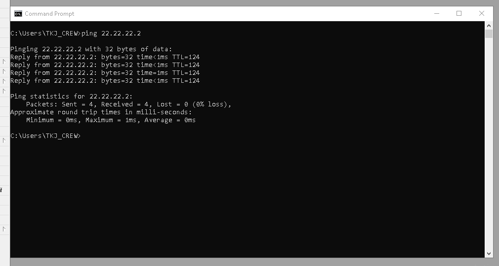

# LAB-20-Static-Routing
tanggal 15 agustus 2025
# Mengkonfigurasi Static Routing dan basic configuration 

**langkah-langkah:**  
**R1**
1. colokkan R1 ke laptop buka winbox     
   pilih menu terminal buatkan password dan user lalu identity    

LOGIN:  

2. masukan ip address untuk eth1 dan eth2    
   pilih Menu IP > Address  
   klik +  

3. konfigurasi static routing 
   pilih menu IP > routes    
   dst-addres= ip laptop B    
   gateway= ip yang akan di pasang di router2  

**R2**  
1. colokkan R2 ke laptop buka winbox  
   pilih menu terminal buatkan password dan user lalu identity  

2. masukan ip address untuk eth1 dan eth2    
   pilih Menu IP > Address  
   klik +  

3. konfigurasi static routing  
   pilih menu IP > routes
   
         1. dst-addres= ip laptop A  
            gateway= ip router1  

         2. dst-addres= ip laptop B  
            gateway= ip yang akan di pasang di router3  

**R3**  
1. colokkan R2 ke laptop buka winbox    
   buatkan password dan user lalu identity  
   system > users  
   system > identity    

LOGIN

2. masukan ip address untuk eth1 dan eth2      
   pilih Menu IP > Address    
   klik +
ether1 = 12.12.12.6/30 (untuk koneksi R3 ke R2)  
ether2 = 12.12.12.9/30 (untuk koneksi R3 ke R4)    

3. konfigurasi static routing    
   pilih menu IP > routes    
dst addrs=11.11.11.0/27 gateway=12.12.12.5 (Ke Laptop A lewat R2)    
dst addrs=22.22.22.0/29 gateway=12.12.12.10 (Ke Laptop B lewat R4)       

**R4**  
Dirouter 4, kita akan coba konfigurasi mengunakan mode CLI.  
1. Buat username dan password sesuai perintah di Topologi.  

         user add name=ahnaf password=jaringan group=full

2. Ganti Identitas RB menjadi R4.  

          system identity set name=R4
     
3. Tambahkan IP Address untuk ether1 dan ether2.  
ether1 = 12.12.12.10/30 (untuk koneksi R4 ke R3)  
ether2 = 22.22.22.1/29 (untuk koneksi R4 ke Laptop B)  

          ip address add interface=ether1 address=12.12.12.10/30  
          ip address add interface=ether2 address=22.22.22.1/29  

4. Sekarang konfigurasi static routing  
dst addrs=11.11.11.0/27 gateway=12.12.12.9 (Ke Laptop A lewat R2)  

          ip route add dst-address=11.11.11.0/27 gateway=12.12.12.9  
------------------------------------------------------------------------------------------------------------------------------------------------------------------------------------------
# pengujian
**setting ip laptop A**  

**setting ip laptop B**  

 

**ping ke ip laptop A**  

**ping ke ip laptop B**

# kesimpulan
Jadi, Static routing adalah konfigurasi jaringan di mana jalur data antar perangkat jaringan ditentukan secara manual. Static routing tidak akan berubah kecuali diubah.
