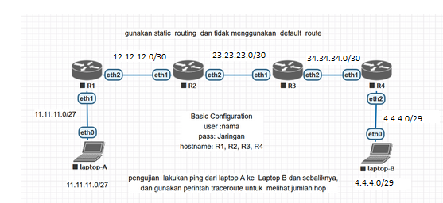
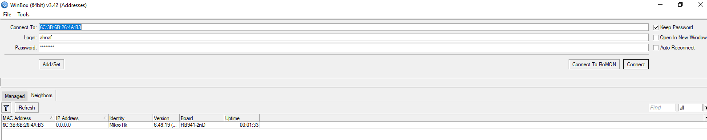

# LAB-20-Static-Routing
tanggal 15 agustus 2025
# Mengkonfigurasi Static Routing dan basic configuration 

**langkah-langkah:**  
**R1**
1. colokkan R1 ke laptop buka winbox     
   pilih menu terminal buatkan password dan user lalu identity    

LOGIN:  

2. masukan ip address untuk eth1 dan eth2    
   pilih Menu IP > Address  
   klik +  

3. konfigurasi static routing 
   pilih menu IP > routes    

**R2**  
1. colokkan R2 ke laptop buka winbox  
   pilih menu terminal buatkan password dan user lalu identity  

2. masukan ip address untuk eth1 dan eth2    
   pilih Menu IP > Address  
   klik +
   

4. konfigurasi static routing  
   pilih menu IP > routes

**R3**  
1. colokkan R2 ke laptop buka winbox    
   buatkan password dan user lalu identity  
   system > users  
   system > identity    

LOGIN

2. masukan ip address untuk eth1 dan eth2      
   pilih Menu IP > Address    
   klik +
   

4. konfigurasi static routing    
   pilih menu IP > routes

**R4**  
Dirouter 4, kita akan coba konfigurasi mengunakan mode CLI.  
1. Buat username dan password sesuai perintah di Topologi.  

         user add name=ahnaf password=jaringan group=full

2. Ganti Identitas RB menjadi R4.  

          system identity set name=R4
     
3. Tambahkan IP Address untuk ether1 dan ether2.  

 

4. Sekarang konfigurasi static routing

-------------------------------------------------------------------------------------------------------------------------------------------------------------------------------
# pengujian
**setting ip laptop A**  

**setting ip laptop B**  

 

tracert dan ping ke pc B

tracert dan ping ke pc A

# kesimpulan
Jadi, Static routing adalah konfigurasi jaringan di mana jalur data antar perangkat jaringan ditentukan secara manual. Static routing tidak akan berubah kecuali diubah.
